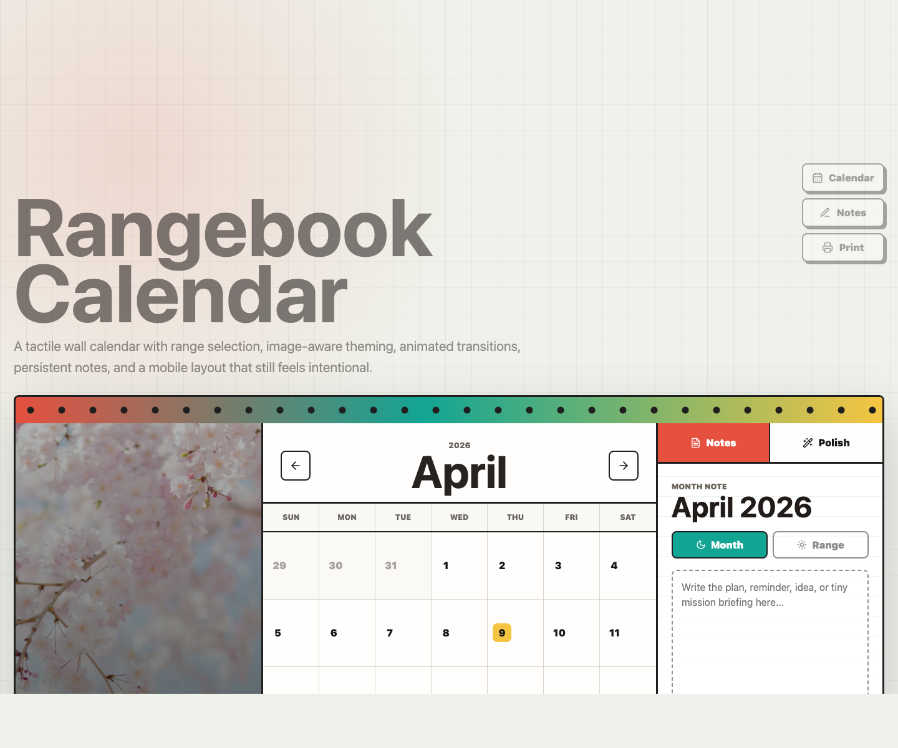

# Rangebook Calendar



Rangebook Calendar is a polished React calendar experience built around one simple idea: a digital calendar should still feel a little physical. I wanted it to feel like something you could hang on a wall, mark with a pen, and come back to later, while still having the smoothness and responsiveness of a modern frontend app.

The original single-file prototype is preserved in `index.html`. The final React version lives in `src/` and runs through Vite at `react.html`.

Created with love by **ADITYA SINGH**  
Passionate frontend engineer, tech alchemist, and detail-obsessed builder of interfaces that feel alive.

- LinkedIn: [linkedin.com/in/adityas72](https://www.linkedin.com/in/adityas72/)
- GitHub: [github.com/adityas72](https://github.com/adityas72)

## What I Built

This is a fully frontend calendar component with a wall-calendar-inspired layout, animated month transitions, date range selection, persistent notes, and responsive behavior for desktop and mobile.

The calendar has three main zones:

- A seasonal image panel that gives every month a different visual tone.
- A date grid where users can select a start date, an end date, and clearly see the days between them.
- A notes panel where users can save either a month-level note or a range-specific note.

There is no backend, database, or API. Notes are saved in the browser using `localStorage`, which keeps the project focused on frontend engineering, interaction design, and component polish.

## Why It Feels Different

I did not want this to look like a generic date picker dropped into a page. The design leans into a tactile, physical-calendar direction: a binding strip, strong borders, paper-like surfaces, seasonal imagery, bold month typography, and note-taking affordances that feel intentional.

The extra layer is motion. Month changes animate instead of snapping. Calendar cells lift on hover. The hero image has subtle scroll depth. The page has smooth anchor navigation and a progress bar at the top, so the whole experience feels more alive without becoming distracting.

## Core Features

- Date range selection with clear start, end, and in-between states.
- Month notes and range notes with browser persistence.
- Seasonal hero image and image-aware accent colors for every month.
- Holiday markers for common dates.
- Recent notes section so saved content feels visible, not hidden.
- Keyboard support: arrow keys move between months, `N` opens notes, and `I` opens the polish panel.
- Print action for a physical-sheet style workflow.
- Responsive layout that moves from a wide wall-calendar composition to a stacked mobile interface.

## Tech Stack

- React for the component structure and state-driven UI.
- Vite for fast local development and production builds.
- Framer Motion for page, month, panel, hover, and scroll animations.
- date-fns for clean date calculations and formatting.
- lucide-react for consistent, lightweight icons.
- CSS for the full visual system, responsive layout, and tactile calendar styling.
- localStorage for client-side note persistence.

## Project Structure

```text
interactive-calendar-challenge/
  assets/
    rangebook-landing.png
  src/
    main.jsx
    styles.css
  index.html
  react.html
  package.json
  vite.config.js
  eslint.config.js
```

`index.html` is the first standalone prototype and is intentionally kept as a reference. `react.html` is the Vite entry for the upgraded React implementation.

## Run Locally

```bash
npm install
npm run dev
```

Then open:

```text
http://127.0.0.1:5173/react.html
```

## Build And Check

```bash
npm run lint
npm run build
```

Both commands are expected to pass.

## Demo Flow

1. Open the React version at `/react.html`.
2. Select a start date and then an end date in the calendar grid.
3. Watch the selected range update in the summary dock.
4. Switch to the range note and write a short note.
5. Move between months with the arrow buttons or keyboard arrow keys.
6. Open the polish panel to show the interaction details.
7. Resize to mobile width to show the stacked layout.
8. Use the print action to show the physical calendar sheet angle.

## Personal Note

This project was built to feel evaluated at two levels: it satisfies the functional requirements, but it also tries to communicate care. The goal was not just to make a calendar work. The goal was to make it feel memorable.
